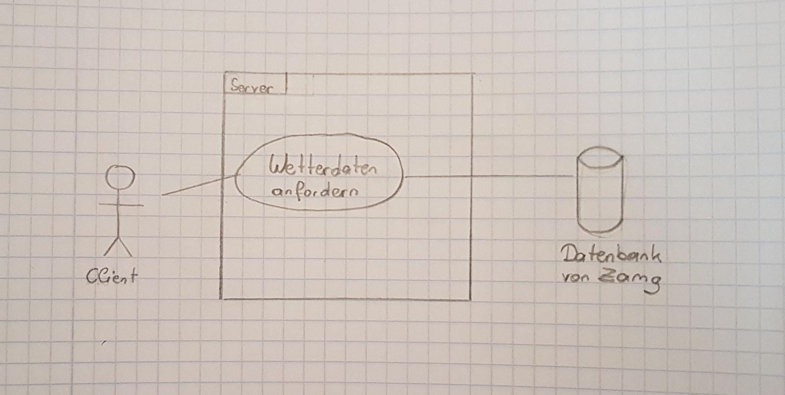

<h1>Pflichtenheft</h1>
<h2>1. Ausgangslage</h2>
    
Wir sind zwei Schülerinnen der Höheren Technischen Bundeslehranstalt in Leonding und besuchen derzeit die 3. Klasse der Abteilung für Medientechnik. Unsere Namen sind Juliana Naderer und Eva Hildenbrand. Da wir in unseren drei Ausbildungsjahren schon öfter zusammen gearbeitet haben, werden wir auch dieses Projekt miteinander machen. Unser Programm soll die aktuelle Wetterlage in den Haupstädten der Bundesländer von Österreich anzeigen.

<h2>2. Ist-Zustand</h2>
    
Für unser Projekt benötigen wir 
        <ul>
            <li>unsere Laptops
            <li>die Datei tawes1h.csv (<a href="http://www.zamg.ac.at/ogd/">http://www.zamg.ac.at/ogd/</a>), in welcher Städte mit gewissen       Temperaturen verzeichnet sind
            <li>Zugriff auf die Datenbank von Zamg (<a href="https://www.zamg.ac.at">https://www.zamg.ac.at</a>)
        </ul>
        Diese benötigten "Dinge" besitzen wir schon, bzw. wir haben Zugriff darauf.
    

<h2>3. Zielsetzung</h2>
    

        <ul>
            <li>Wetterdaten der Datei tawes1h.csv lesen und auf einer Website ausgeben
            <li>Wetterdaten von der Datenbank (<a href="https://www.zamg.ac.at">https://www.zamg.ac.at </a>) holen und auf der Website ausgeben
            <li>Automatisches aktualisieren der Wetterlage
            <li>Designen: 
                <ul type="square">
                    <li>Daten in einer Tabelle ausgeben
                    <li>Österreich-Karte mit verfügbaren Standpunkten (Hauptstädte) versehen
                    <li>evtl. Karte verlinken - Wetter von Standort wird angezeigt
                </ul>
        </ul>
    

<h2>4. Anforderungen</h2>
    
Durch die Website soll man über die aktuelle Wetterlage in den Hauptstädten der Bundesländer von Österreich informiert werden. Die Website aktualisiert sich jede Stunde und soll übersichtlich sowie benutzerfreundlich sein.  
    Es gibt nur einen Use-Case, denn der Benutzer will sich über das Wetter in einer bestimmten Stadt informieren und die Datenbank von Zamg gibt dem User dieses aus.
    
    

<h2>5. Mengengerüst</h2>
    
Die Website kann von mehrerern Benutzern gleichzeitig verwendet werden. Die Datenmenge soll jedoch relativ klein bleiben, da die Wetterdaten von der Datenbank jede Stunde aktualisiert werden.
    
